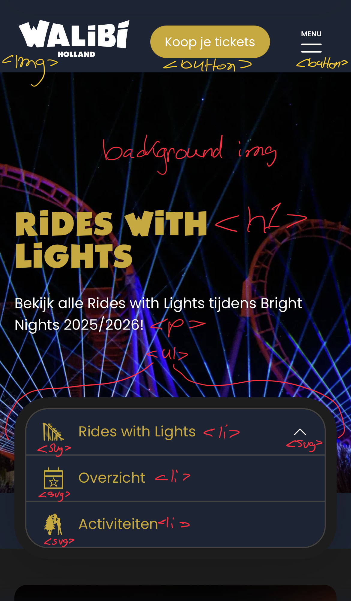
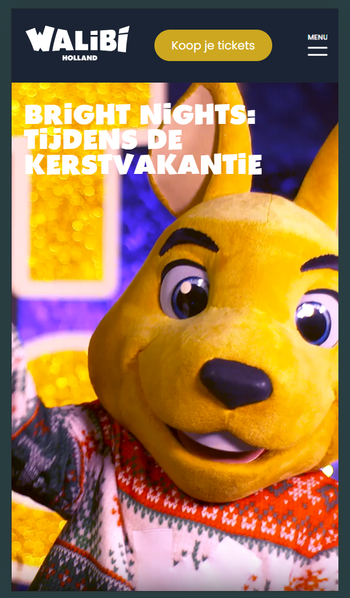
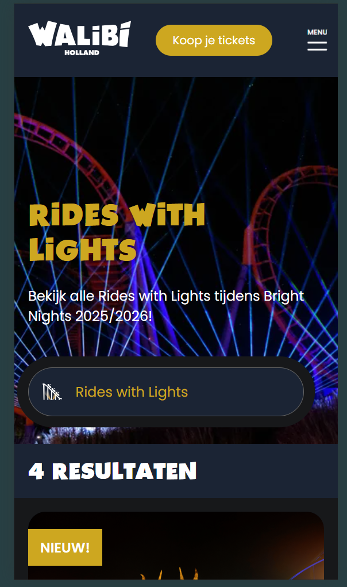
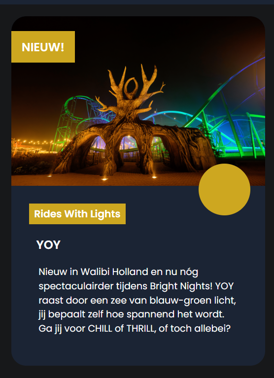
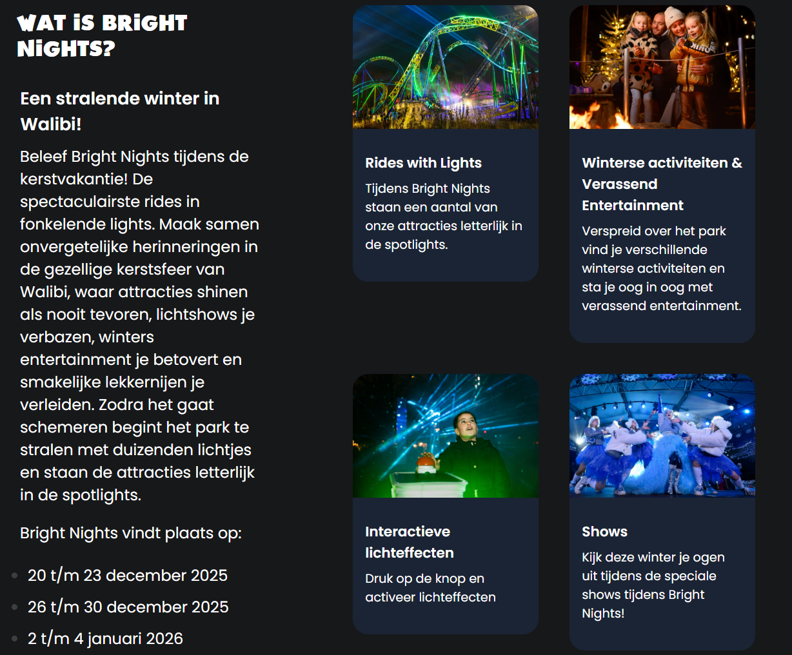

# Procesverslag
Markdown is een simpele manier om HTML te schrijven.  
Markdown cheat cheet: [Hulp bij het schrijven van Markdown](https://github.com/adam-p/markdown-here/wiki/Markdown-Cheatsheet).

Nb. De standaardstructuur en de spartaanse opmaak van de README.md zijn helemaal prima. Het gaat om de inhoud van je procesverslag. Besteedt de tijd voor pracht en praal aan je website.

Nb. Door *open* toe te voegen aan een *details* element kun je deze standaard open zetten. Fijn om dat steeds voor de relevante stuk(ken) te doen.

## Jij

  
uitwerken voor kick-off werkgroep

  ### Auteur:
  Renske Bingen
  #### Je startniveau:
  Rode piste
  #### Je focus:
  Responsive
 

## Je website

  
uitwerken voor kick-off werkgroep

  ### Je opdracht:
  https://www.walibi.nl/brightnights/nl
  https://www.walibi.nl/brightnights/nl/rides-lights

  #### Screenshot(s) van de eerste pagina (small screen): 
  Homepagina  
  
  

  #### Screenshot(s) van de tweede pagina (small screen):
  Rides with lights
  
  
 

## Toegankelijkheidstest 1/2 (week 1)

  
uitwerken na test in 2e werkgroep

  ### Bevindingen
  Lijst met je bevindingen die in de test naar voren kwamen:
  (zie WCAG Checklist in files)

  1. er wordt heel veel gebruik gemaakt van divs en spans. terwijl heel veel ook semantisch kan. zo zie ik geen sections of andere semantische tags.
  2. er worden geen alt teksten gebruikt bij img's.
  3. de website beschikt vanwege de browser focus states, maar er is in het bijzonder geen extra aandacht aan besteed zoals apparte vormgeving hiervoor.
  4. de website is goed responsive. als je de website verbreed en smaller maakt, blijft het goed staan.
  5. de buttons zijn groot genoeg en goed zichtbaar door het contrast.
  6. de headings zijn niet in een logische volgorde. zo staan ze door elkaar heen en gaat het soms van h3 naar h2 naar h4.
  7. wel maken ze gebruik van maar 1 h1 per pagina
  8. voor componenten waar ul's gebruikt voor kunnen worden, worden alleen maar divs en spans gebruikt
  9. de video op de pagina doet aan autoplay, maar deze kan je wel op pauze zetten
  10. de video bevat ook ondertiteling. ik kan geen transcript vinden
  11. voor links worden a tags gebruikt, maar je kan verder niet zien waar het je naartoe brengt etc.
  12. dark en lightmode zijn wel supported. je moet helemaal onderaan in de website naar toegankelijkheid en dan de dropdown aanklikken om vervolgens met schuifjes dit aan te passen. het is goed dat ze het toevoegen, maar de manier waarop is onhandig en ook niet makkelijk vindbaar (kwam er zelf ook pas later achter na het invullen van het WCAG document).
  13. de animaties die in de website zitten zijn met een goede flow erin gezet.
  14. het kleurencontrast wordt goed rekening mee gehouden.
     

## Breakdownschets (week 1)

  
uitwerken na afloop 3e werkgroep

  ### de hele pagina: 
  

  ### dynamisch deel (bijv menu): 
  

## Voortgang 1 (week 2)

  
uitwerken voor 1e voortgang

  ### Stand van zaken
  Na het opzetten van mijn hele HTMl ben ik verder gegaan met de basic layout van de pagina. Zo ben ik begonnen met de header en het stukje waar de video staat. Hier moest ik goed opletten, want mijn website gebruikt 2 videos. 1 voor mobile en de andere voor dekstop. Ik vond het wel een leuke uitdaging om zo ook met de responsiveness aan de gang te gaan. Het enige waar ik niet helemaal uitkwam was hoe ik dit kon doen met CSS zonder heel mijn code te moeten veranderen. Dus heb ik het in de HTML gedaan.

  ### Verslag van meeting
  hier na afloop snel de uitkomsten van de meeting vastleggen

  - Ik kon de video niet vinden in de website, maar na het vragen aan de studenten assistent, had ik ze gevonden en heb ik deze in mijn code gezet.
  - Ik had al wat dingen in mijn code gezet wat ik nog moest aanpassen, omdat ik alleen nog de opzet had gedaan in HTML. Dus ik had erin gezet dat ik de foto's moest comprimeren in CSS en dat ik de H1 hidden moest maken.
  - Alle secties moeten een H2 hebben

## Voortgang 2 (week 3)

  
uitwerken voor 2e voortgang

  ### Stand van zaken
 Bij week 3 was ik al behoorlijk ver met pagina 1, en wilde ik alvast bezig met dingen die mij sowieso alleen lukte, zonder hulp van de docent of studenten assistenten. Daarom had ik al gelijk de opzet van pagina 2 gedaan in HTML en ben ik begonnen met de kaarten van pagina 2. Dit ging mij goed af en was daarom ook extra trots op het resultaat. Het enige waar ik niet helemaal uitkwam was het dropdown menu met de border er om heen. Gelukkig kwam Bahaa mij helpen met het zogenaamde 'box-shadow'. hierdoor heb ik nu het effect van een dubbele border, waar ik ontzettend blij mee ben.

  ### Verslag van meeting
  hier na afloop snel de uitkomsten van de meeting vastleggen

  - Meneer viel op dat mijn header niet responsive was. We hebben er samen even naar gekeken, maaar kwamen er niet snel achter. Meneer gaf aan dat hij er later naar zou kijken en toen kreeg ik een appje op teams waar het aan lag. Dit heb ik gelijk aangepast in mijn code.
  - Ook hadden we een puntje besproken of een bepaalde sectie puur alleen voor opmaak was of ook echt een H2 nodig had voor de screenreader.

## Toegankelijkheidstest 2/2 (week 4)

  
uitwerken na test in 9e werkgroep

Zie de checklist in de files
  ### Bevindingen
  Lijst met je bevindingen die in de test naar voren kwamen (geef ook aan wat er verbeterd is):

  Na het doen van de 2de test zag ik veel verschil in de antwoorden. Voor mijn eigen website stond veel meer in het groen dan bij Walibi. Opzich heeft Walibi een redelijk toegankelijke website en doen ze het echt redelijk oke. Maar ze maken wel stomme fouten als het gaat over de heading volgorde of uberhaupt het semantisch coderen. Bij sommige stukken gaat het goed, maar soms zie je ook veel fouten.

  Ik heb met mijn eigen website mij volledig gehouden aan hoe de headings werken. Zo heb ik een h1 die hidden is in mijn homepagina. Omdat de werkelijke h1 niks vertelde bij de website van Walibi. Ook heb ik bij elke sectie die daadwerkelijk een functie heeft een h2 neergezet. Deze zijn ook hidden, maar ze vertellen wel wat de sectie inhoud. 

  Bij elke buttons heb ik een aria-label toegevoegd en bij mijn video ook zodat dit word meegelezen door de screenreader. Ook bij alle images heb ik een alt-tag toegevoegd, zodat deze ook worden meegelezen met de screenreader.

  Ik heb mijn code door de validators gehaald en hier kwamen geen errors uit. Er kwamen een paar warnings uit voor geen titel bij een section. Waar nodig was, heb ik dit aangepast en als het alleen puur voor opmaak was, heb ik het zo gelaten.

  Bij de website van Walibi heb je geen light of darkmode. Het staat technisch gezien al in darkmode. Daarom heb ik bij mijn website een lightmode met de media query toegevoegd. Dan kan de gebruiker de website zien in hun aangegeven voorkeur. 

  Ik heb bij alle buttons een hover functie toegepast en een focus state. Deze doen het allemaal. Omdat ik natuurlijk geen 100 pagina's heb gemaakt, sturen de buttons je niet door naar een andere pagina, maar dat zou wel kunnen als ik er een pagina aan zou linken.

  Bij de website van Walibi gebruiken ze ontzettend veel divs en spans voor list elementen. Ik heb dit niet zo gedaan en gewoon ul en li gebruikt.

  Bij de video heb ik deze niet op autoplay en begint deze ook gemute. De video op de website van Walibi begint gelijk als je de website opent.

  Wat heb ik nog niet:

  Op dit moment support de website van mij geen high contrast mode. Dit komt onder andere door gebrek aan tijd.
  Ook heb ik nog geen skip link. 

  

## Voortgang 3 (week 4)

  
uitwerken voor 3e voortgang

  ### Stand van zaken
  Hier had ik al het meeste af van allebei de pagina's en was ik nog een beetje de punjtes op de i aan het zetten. Ik was hier bezig met de animatie van de header. Deze heb ik gemaakt met de hulp van ChatGPT en daardoor lukte het me aardig goed. Ik dacht te zien op de Walibi website dat de animatie vanuit het midden van het scherm kwam, maar deze kwam vanit links boven in de hoek. Ik had aan Bahaa gevraagd of hij hier misschien mee kon helpen, maar dat is helaas niet meer gelukt. Toch ben ik uiteindelijk erg blij met het resultaat.

  ### Verslag van meeting
  hier na afloop snel de uitkomsten van de meeting vastleggen

  - Ik had gevraagd aan de studenten assistent of er naar mijn animatie van mijn header gekeken kon worden. Ik heb de animatie namelijk startend in het midden van mijn scherm. Eigenlijk moest dit vanuit de linkerkant van het scherm, maar ik kreeg het niet aangepast. Helaas was hier geen tijd meer voor. Ik had Bahaa nog een teams berichtje gestuurd, maar helaas had hij het druk.
  - Ik kreeg ook als tip om mijn video niet op autoplay te zetten en deze ook gemute te laten starten. Dit is voor de toegankelijkheid beter.
  - Voor het eerste carousel gaf Bahaa aan dat het misschien leuker was om de uitlijning van de foto's in het midden te doen. Ik heb het uiteindelijk gelaten als hoe het was, omdat mijn 2de carousel al zo was en ik dacht voor de opmaak is het misschien ook leuker om 2 verschillende te hebben.

## Eindgesprek (week 5)

  
uitwerken voor eindgesprek

  ### Je uitkomst - karakteristiek screenshots:
  
  

  ### Dit ging goed/Heb ik geleerd: 
  Ik heb hier aan de hand met flexbox kaarten gemaakt om de content in 1 wrapper te krijgen. ik heb een beetje gekeken naar mijn oude code voor de opzet en met een beetje hulp van chat ging dit veel beter als verwacht. Ik zat hier heel erg tegen op, maar het veel echt reuze mee.

  

  ### Dit was lastig/Is niet gelukt:
  Het responsive gedeelte is niet persee niet gelukt, maar ik vond het wat lastiger, voornamelijk omdat je goed moet kijken in de inspect of daadwerkelijk alles meebeweegt. Ik vind het wel intressant om te weten hoe dit moest en heb er daarom ook wel plezier uit gehaald.

  Voor het dropdown menu ging dit eigenlijk ook wel prima, alleen duwt die de image mee naar beneden terwijl her er eigenlijk overheen moet vallen. Het is niet persee storend. maar het is wel iets wat mij niet helemaal is gelukt. Ook door de hover functie (omdat het word gezien als knop) blijft die soms geel. Ik heb het soms wel en soms niet.

  
  

## Bronnenlijst

  
continu bijhouden terwijl je werkt

  Nb. Wees specifiek ('css-tricks' als bron is bijv. niet specifiek genoeg). 
  Nb. ChatGpT en andere AI horen er ook bij.
  Nb. Vermeld de bronnen ook in je code.

  1. https://www.w3schools.com/tags/att_video_autoplay.asp -> video controls
  2. https://css-tricks.com/snippets/css/a-guide-to-flexbox/ -> flexbox, order etc
  3. https://www.w3schools.com/howto/howto_css_bullet_color.asp -> bullet color lists
  4. https://www.w3schools.com/cssref/pr_background-image.php -> background images
  5. https://www.w3schools.com/css/css3_shadows_box.asp -> box shadow
  6. https://chatgpt.com/ -> hamburger menu overlay, animatie hamburger menu, slider carousel, carousel opzet, dropdown menu

