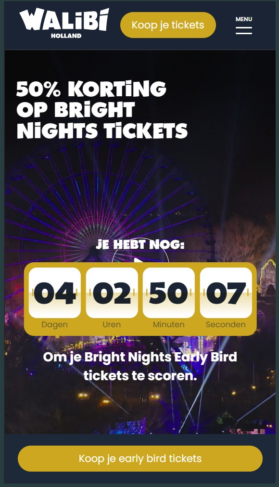
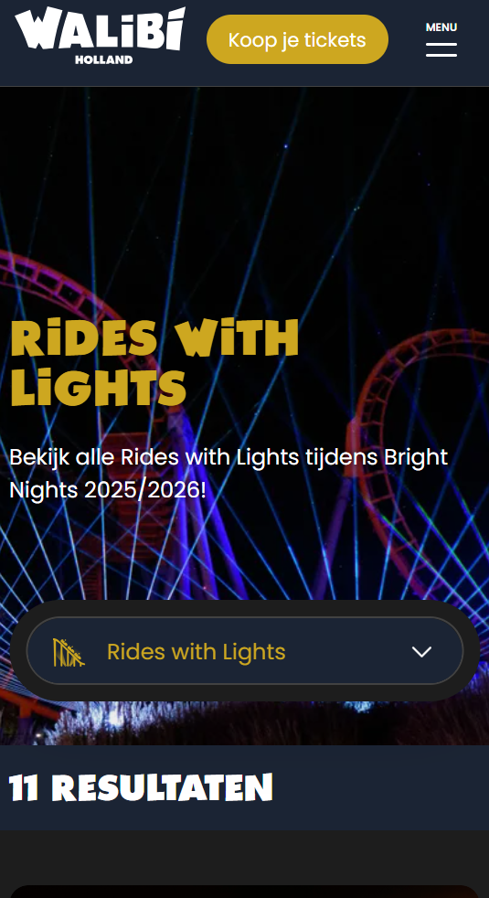

# Procesverslag
Markdown is een simpele manier om HTML te schrijven.  
Markdown cheat cheet: [Hulp bij het schrijven van Markdown](https://github.com/adam-p/markdown-here/wiki/Markdown-Cheatsheet).

Nb. De standaardstructuur en de spartaanse opmaak van de README.md zijn helemaal prima. Het gaat om de inhoud van je procesverslag. Besteedt de tijd voor pracht en praal aan je website.

Nb. Door *open* toe te voegen aan een *details* element kun je deze standaard open zetten. Fijn om dat steeds voor de relevante stuk(ken) te doen.

## Jij

  
uitwerken voor kick-off werkgroep

  ### Auteur:
  Renske Bingen
  #### Je startniveau:
  Rode piste
  #### Je focus:
  Responsive
 

## Je website

  
uitwerken voor kick-off werkgroep

  ### Je opdracht:
  https://www.walibi.nl/brightnights/nl
  https://www.walibi.nl/brightnights/nl/rides-lights

  #### Screenshot(s) van de eerste pagina (small screen): 
  Homepagina  
  
  

  #### Screenshot(s) van de tweede pagina (small screen):
  Rides with lights
  
  
 

## Toegankelijkheidstest 1/2 (week 1)

  
uitwerken na test in 2e werkgroep

  ### Bevindingen
  Lijst met je bevindingen die in de test naar voren kwamen:

  1. er wordt heel veel gebruik gemaakt van divs en spans. terwijl heel veel ook semantisch kan. zo zie ik geen sections of andere semantische tags.
  2. er worden geen alt teksten gebruikt bij img's.
  3. de website beschikt vanwege de browser focus states, maar er is in het bijzonder geen extra aandacht aan besteed zoals apparte vormgeving hiervoor.
  4. de website is goed responsive. als je de website verbreed en smaller maakt, blijft het goed staan.
  5. de buttons zijn groot genoeg en goed zichtbaar door het contrast.
  6. de headings zijn niet in een logische volgorde. zo staan ze door elkaar heen en gaat het soms van h3 naar h2 naar h4.
  7. wel maken ze gebruik van maar 1 h1 per pagina
  8. voor componenten waar ul's gebruikt voor kunnen worden, worden alleen maar divs en spans gebruikt
  9. de video op de pagina doet aan autoplay, maar deze kan je wel op pauze zetten
  10. de video bevat ook ondertiteling. ik kan geen transcript vinden
  11. voor links worden a tags gebruikt, maar je kan verder niet zien waar het je naartoe brengt etc.
  12. dark en lightmode zijn wel supported. je moet helemaal onderaan in de website naar toegankelijkheid en dan de dropdown aanklikken om vervolgens met schuifjes dit aan te passen. het is goed dat ze het toevoegen, maar de manier waarop is onhandig en ook niet makkelijk vindbaar (kwam er zelf ook pas later achter na het invullen van het WCAG document).
  13. de animaties die in de website zitten zijn met een goede flow erin gezet.
  14. het kleurencontrast wordt goed rekening mee gehouden.
     

## Breakdownschets (week 1)

  
uitwerken na afloop 3e werkgroep

  ### de hele pagina: 
  

  ### dynamisch deel (bijv menu): 
  

  ### wellicht nog een dynamisch deel (bijv filter): 
  

## Voortgang 1 (week 2)

  
uitwerken voor 1e voortgang

  ### Stand van zaken
  hier dit ging goed & dit was lastig (neem ook screenshots op van delen van je website en code)

  ### Verslag van meeting
  hier na afloop snel de uitkomsten van de meeting vastleggen

  - Ik kon de video niet vinden in de website, maar na het vragen aan de studenten assistent, had ik ze gevonden en heb ik deze in mijn code gezet.
  - Ik had al wat dingen in mijn code gezet wat ik nog moest aanpassen, omdat ik alleen nog de opzet had gedaan in HTML. Dus ik had erin gezet dat ik de foto's moest comprimeren in CSS en dat ik de H1 hidden moest maken.
  - Alle secties moeten een H2 hebben

## Voortgang 2 (week 3)

  
uitwerken voor 2e voortgang

  ### Stand van zaken
  hier dit ging goed & dit was lastig (neem ook screenshots op van delen van je website en code)

  ### Verslag van meeting
  hier na afloop snel de uitkomsten van de meeting vastleggen

  - Meneer viel op dat mijn header niet responsive was. We hebben er samen even naar gekeken, maaar kwamen er niet snel achter. Meneer gaf aan dat hij er later naar zou kijken en toen kreeg ik een appje op teams waar het aan lag. Dit heb ik gelijk aangepast in mijn code.
  - Ook hadden we een puntje besproken of een bepaalde sectie puur alleen voor opmaak was of ook echt een H2 nodig had voor de screenreader.

## Toegankelijkheidstest 2/2 (week 4)

  
uitwerken na test in 9e werkgroep

  ### Bevindingen
  Lijst met je bevindingen die in de test naar voren kwamen (geef ook aan wat er verbeterd is):

## Voortgang 3 (week 4)

  
uitwerken voor 3e voortgang

  ### Stand van zaken
  hier dit ging goed & dit was lastig (neem ook screenshots op van delen van je website en code)

  ### Verslag van meeting
  hier na afloop snel de uitkomsten van de meeting vastleggen

  - Ik had gevraagd aan de studenten assistent of er naar mijn animatie van mijn header gekeken kon worden. Ik heb de animatie namelijk startend in het midden van mijn scherm. Eigenlijk moest dit vanuit de linkerkant van het scherm, maar ik kreeg het niet aangepast. Helaas was hier geen tijd meer voor. Ik had Bahaa nog een teams berichtje gestuurd, maar helaas had hij het druk.
  - punt 2
  - nog een punt
  - ...

## Eindgesprek (week 5)

  
uitwerken voor eindgesprek

  ### Je uitkomst - karakteristiek screenshots:
  

  ### Dit ging goed/Heb ik geleerd: 
  Korte omschrijving met plaatjes

  

  ### Dit was lastig/Is niet gelukt:
  Korte omschrijving met plaatjes

  

## Bronnenlijst

  
continu bijhouden terwijl je werkt

  Nb. Wees specifiek ('css-tricks' als bron is bijv. niet specifiek genoeg). 
  Nb. ChatGpT en andere AI horen er ook bij.
  Nb. Vermeld de bronnen ook in je code.

  1. bron 1
  2. bron 2
  3. ...

